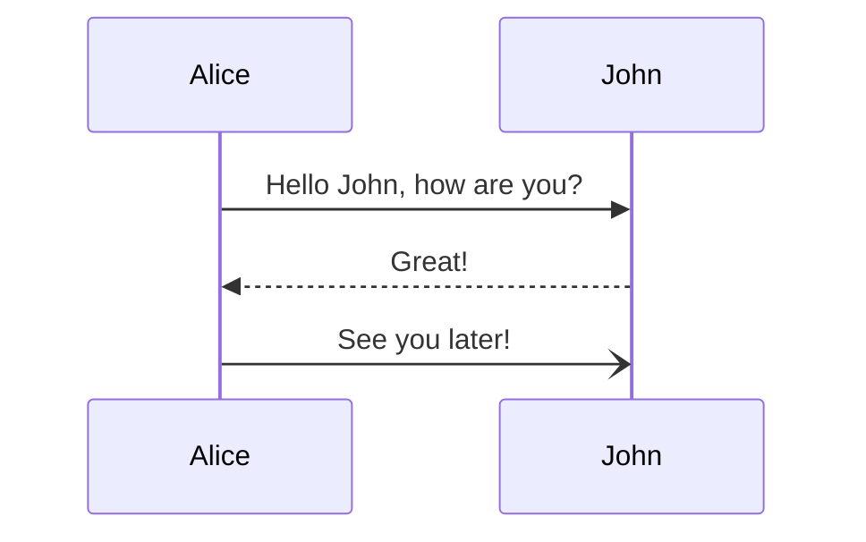

import { state1, Heading } from "../../../states/data.ts";
export const final = "Exportacion";
import HeadingComponent from './HeadingComponent';

# {final}

<HeadingComponent />


# {frontmatter.title}

<ul class="information">
  <li>Written by: {frontmatter.author}</li>
  <li>Description: {frontmatter.description}</li>
</ul>

¡Bienvenido a Aquicreamos! A continuación, te proporcionaré instrucciones sobre cómo leer parámetros de consulta (query params) y parámetros de ruta (path params) en una aplicación Java con Spring Boot.

<iframe
  class="youtube"
  src="https://www.youtube.com/embed/VsRwPuGrxOc"
  frameborder="0"
  allow="accelerometer; autoplay; clipboard-write; encrypted-media; gyroscope; picture-in-picture"
  allowfullscreen
></iframe>

### 1. Crear una aplicación Spring Boot

Primero, asegúrate de tener una aplicación Spring Boot en funcionamiento. Puedes crear una nueva aplicación utilizando Spring Initializr o importando una existente.

### 2. Lectura de Parámetros de Ruta (Path Params)

Los parámetros de ruta se definen directamente en la URL y se accede a ellos en el controlador utilizando la anotación `@PathVariable`.



#### Ejemplo:

```java
import org.springframework.web.bind.annotation.PathVariable;
import org.springframework.web.bind.annotation.RequestMapping;
import org.springframework.web.bind.annotation.RestController;

@RestController
@RequestMapping("/api")
public class MyController {

    @RequestMapping("/greet/{name}")
    public String greet(@PathVariable String name) {
        return "Hola " + name + "!";
    }
}
```

**Uso:** Si haces una solicitud GET a `/api/greet/Alice`, la respuesta será `"Hola Alice!"`.

### 3. Lectura de Parámetros de Consulta (Query Params)

Los parámetros de consulta se agregan a la URL después del signo de interrogación `?` y se accede a ellos en el controlador utilizando la anotación `@RequestParam`.

#### Ejemplo:

```java
import org.springframework.web.bind.annotation.RequestParam;
import org.springframework.web.bind.annotation.RequestMapping;
import org.springframework.web.bind.annotation.RestController;

@RestController
@RequestMapping("/api")
public class MyController {

    @RequestMapping("/greet")
    public String greet(@RequestParam String name) {
        return "Hola " + name + "!";
    }
}
```

**Uso:** Si haces una solicitud GET a `/api/greet?name=Alice`, la respuesta será `"Hola Alice!"`.

### 4. Parámetros con valores predeterminados y obligatorios

Puedes especificar valores predeterminados y también indicar si un parámetro es obligatorio o no.

```java
@RequestMapping("/greet")
public String greet(@RequestParam(value = "name", defaultValue = "Mundo") String name) {
    return "Hola " + name + "!";
}
```

**Uso:** Si haces una solicitud GET a `/api/greet`, la respuesta será `"Hola Mundo!"`, mientras que `/api/greet?name=Bob` devolverá `"Hola Bob!"`.

### Resumen

- Usa `@PathVariable` para leer parámetros de ruta.
- Usa `@RequestParam` para leer parámetros de consulta.
- Puedes establecer valores predeterminados en los parámetros de consulta.

Con estos ejemplos, deberías poder manejar tanto path params como query params en tu aplicación Spring Boot. ¡Si tienes más preguntas o necesitas ejemplos adicionales, no dudes en preguntar!
